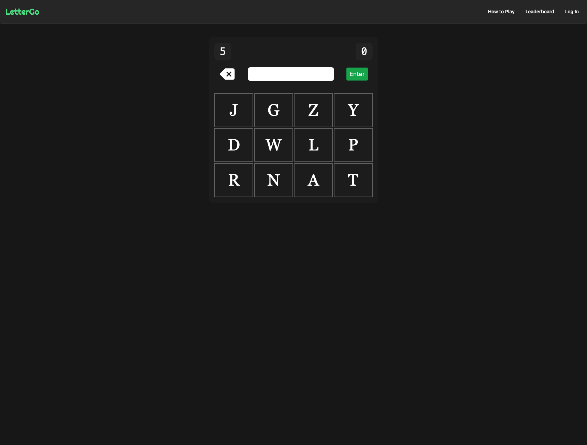

# LetterGo

## Live Demo

- https://lettergo.vercel.app

## Summary

- **_LetterGo_** is a word game that challenges users to form as many heterograms as possible before the timer expires.
- It features a global high score leaderboard.
- Allows for OAuth 2.0 user registration via GitHub.

## Background

I always wanted to create a browser video game with flashy graphics and cool gameplay, but I figured it would probably be a good idea to first make a game that didn't require any kind of graphical rendering, was easy to plan and execute, and was simple to play. _LetterGo_ ended up challenging me to implement game logic and consider a lot of different edge-cases in that logic. Overall, I would consider this app to have been a great learning experience, and although the game is simple, I'm a firm believer that simplicity in games is often a virtue, not a fault.

## Technologies Used

- [Node.js](https://github.com/nodejs/node)
- [Prisma](https://www.prisma.io/)
- [PostgreSQL](https://www.postgresql.org/)
- [NextAuth](https://next-auth.js.org/)
- [React-Redux](https://github.com/reduxjs/react-redux)
- [Tailwind CSS](https://tailwindcss.com/)

## Hosting Services

- [Vercel](https://www.vercel.com) (back-end & front-end)
- [Render](https://www.render.com) (database)

